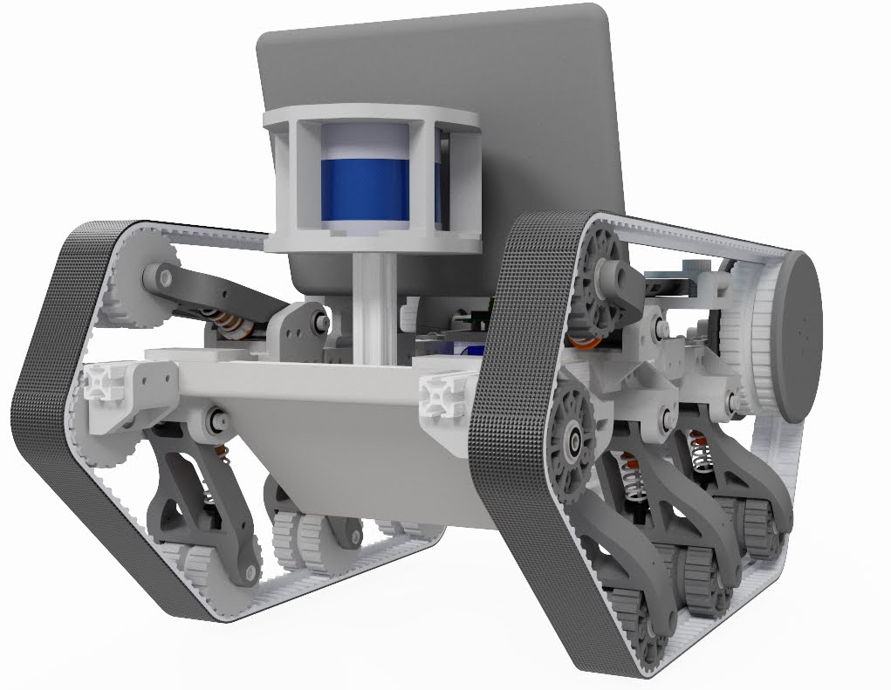
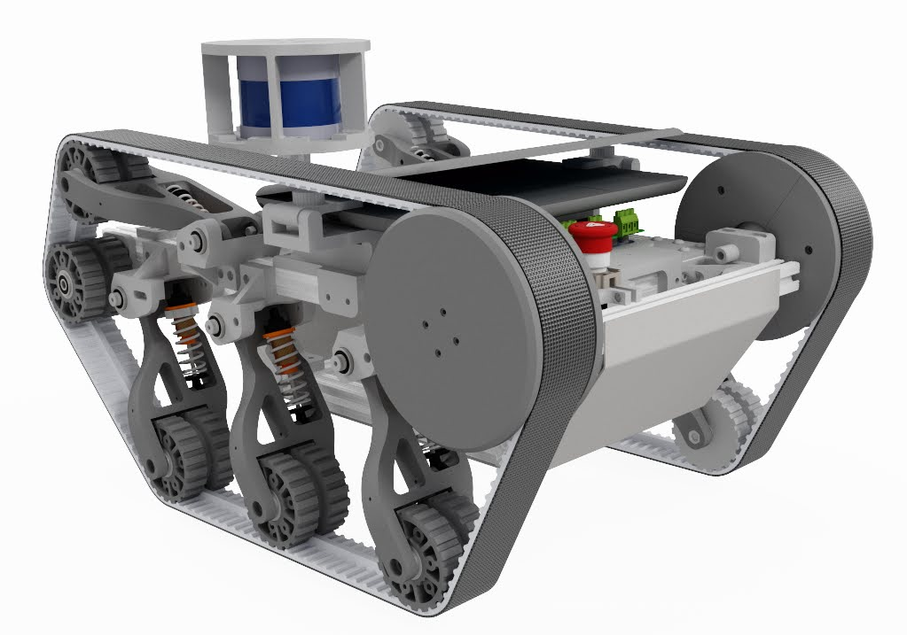

# Woodhouse

A tracked robotic platform for LiDAR mapping and valet applications


<table>
  <tr>
    <td style="text-align: center;">
      
    </td>
    <td style="text-align: center;">
      
    </td>
  </tr>
</table>


# Requirements 
* joy

```sudo apt-get install ros-noetic-joy```

* icet 
* teleop-twist-joy
```
cd ~/catkin_ws/src
git clone https://github.com/mcdermatt/icet
git clone https://github.com/ros-teleop/teleop_twist_joy
catkin_make
```

* gtsam

# Running

#### Controller input

Run node for joystick input

```rosrun joy joy_node```

Run node to convert button output to twist message

```rosparam load $(rospack find woodhouse)/config/joy_config.yaml /teleop_twist_joy```

```rosrun teleop_twist_joy teleop_node```

``` python3 cmd_vel_to_odrive.py```

# TODO

#### General
* [X] Set up laptop for control
* [X] Set up repo

#### Basic motion

* [X] Convert controller input to twist msg
* [X] Convert twist to odrive command
* [X] Fine tune motor gains
* [X] Tune turning radius
* [ ] publish battery status

#### Mapping and Localization

* [X] run ICET odometry
* [X] Create keyframe grabber node (simple python)
* [ ] Get keyframe descriptor-- scan context
* [ ] Create loop closure detection node
* [ ] compile gtsam for pose factors
* [ ] get factor graph node working 

#### Hardware

* [ ] attach LiDAR sensor
* [X] Order 80/20
* [X] Spec dampers
* [X] Get 8bitdo controller talking
 
 ```sudo nano /etc/udev/rules.d/99-8bitdo-xinput.rules ```

   ```ACTION=="add", ATTRS{idVendor}=="2dc8", ATTRS{idProduct}=="3106", RUN+="/sbin/modprobe xpad", RUN+="/bin/sh -c 'echo 2dc8 3106 > /sys/bus/usb/drivers/xpad/new_id'"```

* [ ] Laptop mount
* [ ] LiDAR mount
* [X] Tune damper tension for platform weight
* [X] Replace PSU with LIPOs
* [X] Add shrinkwrapped CAD to repo
* [X] CAD electronics enclosure for odrive + cpu + batteries
* [ ] Spec sendcutsend sheet metal enclosure
 