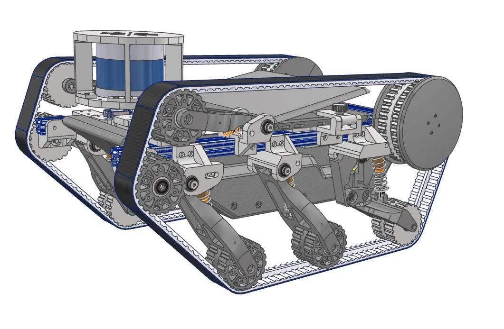
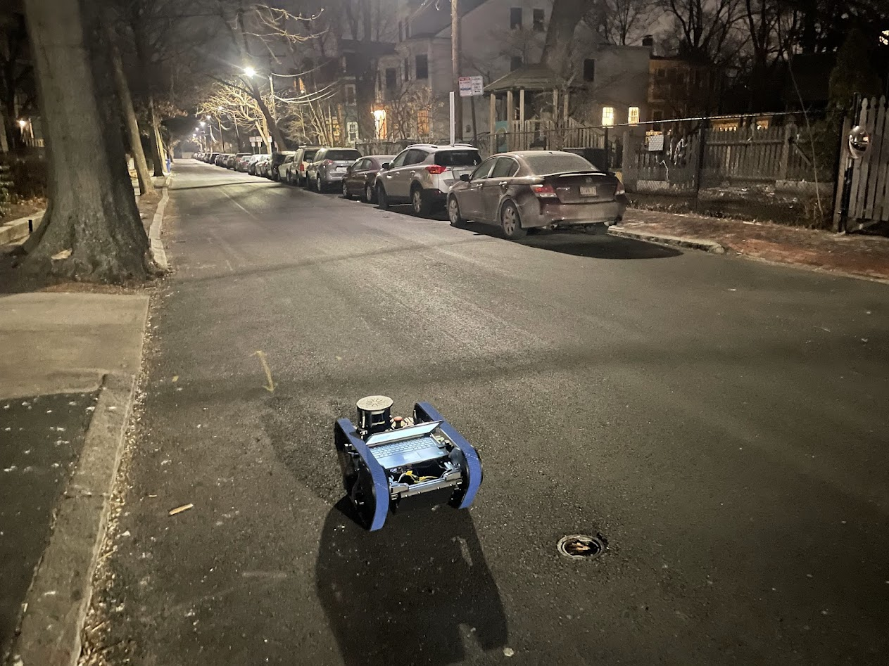

# Woodhouse

A tracked robotic platform for LiDAR mapping and valet applications


<table>
  <tr>
    <td style="text-align: center;">
      
    </td>
    <td style="text-align: center;">
      
    </td>
  </tr>
</table>


#### Mapping Overview


# Requirements 
* joy

```sudo apt-get install ros-noetic-joy```

* icet 

* teleop-twist-joy
```
cd ~/catkin_ws/src
git clone https://github.com/mcdermatt/icet
git clone https://github.com/ros-teleop/teleop_twist_joy
catkin_make
```

* install 8bitdo controller ROS driver:
 
 ```
 sudo nano /etc/udev/rules.d/99-8bitdo-xinput.rules 

 ACTION=="add", ATTRS{idVendor}=="2dc8", ATTRS{idProduct}=="3106", RUN+="/sbin/modprobe xpad", RUN+="/bin/sh -c 'echo 2dc8 3106 > /sys/bus/usb/drivers/xpad/new_id'"
 ```

* gtsam
```
cd ~/catkin_ws/src
git clone https://github.com/borglab/gtsam.git
git checkout 4.3.0 

mkdir build && cd build
<!-- cmake .. -DGTSAM_USE_SYSTEM_EIGEN=ON -DGTSAM_WITH_EIGEN_MKL=OFF -DGTSAM_BUILD_WITH_MARCH_NATIVE=ON -DGTSAM_BUILD_EXAMPLES_ALWAYS=OFF -DGTSAM_BUILD_TESTS=OFF -DGTSAM_BUILD_PYTHON=ON -DGTSAM_USE_SYSTEM_EIGEN=ON -DCMAKE_BUILD_TYPE=Release -->

cmake .. -DGTSAM_BUILD_WITH_MARCH_NATIVE=OFF -DGTSAM_USE_SYSTEM_EIGEN=ON -DGTSAM_WITH_TBB=ON -DGTSAM_BUILD_PACKAGING=ON -DADDRESS_SANITIZER=OFF

make -j$(nproc)
sudo make install

pip install jupyter pybind11
```
https://github.com/MIT-SPARK/Kimera-VIO-ROS/issues/12

https://github.com/RobustFieldAutonomyLab/LeGO-LOAM/issues/247 

use the following command to make sure we are linking our executables against the correct installation of GTSAM 

```
ldd ~/ROS/devel/lib/woodhouse/pose_graph_node | grep gtsam

```

* install Velodyne drivers
```
git clone https://github.com/ros-drivers/velodyne/tree/dashing-devel
``` 


# Running

### Velodyne LiDAR Sensor

```
roslaunch velodyne_pointcloud VLP-32C_points.launch
```

### Controller input

Run node for joystick input

```rosrun joy joy_node```

Run node to convert button output to twist message

```rosparam load $(rospack find woodhouse)/config/joy_config.yaml /teleop_twist_joy```

```rosrun teleop_twist_joy teleop_node```

``` python3 cmd_vel_to_odrive.py```

# TODO

#### Platform

* [ ] publish battery status

#### Mapping and Localization

* [ ] compile gtsam with python binds
* [ ] Fix reflections off back of laptop! 

#### Hardware

* [ ] Add assemble new rear belt tensioners

* [ ] Push updated CAD