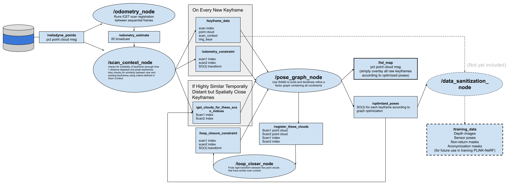

# Woodhouse

A tracked robotic platform and end-to-end LiDAR SLAM system


## Hardware Overview 


* Fully open source 3D printable design-- [CAD Files Here](https://github.com/mcdermatt/woodhouse/tree/main/CAD)
* Capable of driving __up snowbanks__ and __down stairs__
* Vehicle BOM < $500 USD
* Watertight hull, 50lb max payload, max speed 15 mph

<table>
  <tr>
    <td style="text-align: center;">
      
    </td>
    <td style="text-align: center;">
      
    </td>
  </tr>
</table>

## Mapping Overview



* ```rosrun icet odometry_node``` or ```rosrun icet map_maker_node```
    * Produces raw LiDAR odometry estimates from sensor data stream using my ICET algorithm.
    * [For full code and documentation on ICET check out the repository here](https://github.com/mcdermatt/ICET)
* ```rosrun woodhouse scan_context_node```
    * Generates new keyframe if the platform has moved enough since the last keyframe
    * If there's enough similarity between nearby keyframes, asks loop closer node (via pose graph node) to register the two clouds in order to add an additional constraint to the graph.
* ```rosrun woodhouse loop_closer_node``` or ```rosrun woodhouse loop_closer_eigen_node```
    * Runs scan registration between arbitrary keyframes
* ```rosrun woodhouse pose_graph_node```
    * holds on to all keyframe point clouds and assicoated absolute positions. Uses iSAM2 to optimize all constraints.  


<table>
  <tr>
    <td style="text-align: center;">
      
    </td>
    <td style="text-align: center;">
      
    </td>
  </tr>
</table>


Example map generated in real time by driving the above system around my apartment at high speed. Red dots represent optimized keyframe locations. Blur and ghosting in map is due to my reflective cabinets and tile floors-- outoor demo coming soon!

# Requirements 
* joy

```sudo apt-get install ros-noetic-joy```

* icet 

* teleop-twist-joy
```
cd ~/catkin_ws/src
git clone https://github.com/mcdermatt/icet
git clone https://github.com/ros-teleop/teleop_twist_joy
catkin_make
```

* install 8bitdo controller ROS driver:
 
 ```
 sudo nano /etc/udev/rules.d/99-8bitdo-xinput.rules 

 ACTION=="add", ATTRS{idVendor}=="2dc8", ATTRS{idProduct}=="3106", RUN+="/sbin/modprobe xpad", RUN+="/bin/sh -c 'echo 2dc8 3106 > /sys/bus/usb/drivers/xpad/new_id'"
 ```

* gtsam
```
cd ~/catkin_ws/src
git clone https://github.com/borglab/gtsam.git
git checkout 4.3.0 

mkdir build && cd build
cmake .. -DGTSAM_BUILD_WITH_MARCH_NATIVE=OFF -DGTSAM_USE_SYSTEM_EIGEN=ON -DGTSAM_BUILD_PACKAGING=ON
make -j$(nproc)
sudo make install

```
https://github.com/MIT-SPARK/Kimera-VIO-ROS/issues/12

https://github.com/RobustFieldAutonomyLab/LeGO-LOAM/issues/247 

use the following command to make sure we are linking our executables against the correct installation of GTSAM 

```
ldd ~/ROS/devel/lib/woodhouse/pose_graph_node | grep gtsam

```

* install Velodyne drivers
```
git clone https://github.com/ros-drivers/velodyne/tree/dashing-devel
``` 


# Running

### Velodyne LiDAR Sensor

```
roslaunch velodyne_pointcloud VLP-32C_points.launch
```

### Controller input

Run node for joystick input

```rosrun joy joy_node```

Run node to convert button output to twist message

```rosparam load $(rospack find woodhouse)/config/joy_config.yaml /teleop_twist_joy```

```rosrun teleop_twist_joy teleop_node```

``` python3 cmd_vel_to_odrive.py```

### Ublox GPS

```
sudo stty -F /dev/ttyUSB0 38400
sudo cat /dev/ttyUSB0
roslaunch ublox_gps neo_f10n.launch
```

# TODO

#### Mapping and Localization

* [ ] Integrate real-time graph pruning
* [ ] Add interface for GPS priors

#### Hardware

* [ ] Push CAD 4.1

#### Platform

* [ ] publish battery status
* [ ] consolidate everything into single launch file
